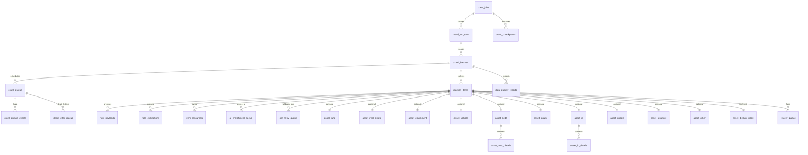

# 拍卖资产采集系统数据库表结构设计 V2

## 1. 设计目标

本设计用于后续正式落地到 MySQL 数据库 `auction_data`。系统不再只服务京东拍卖，而是面向京东拍卖、阿里拍卖、e交易、产权交易平台等多来源数据统一存储。

核心目标：

- 支持多平台采集，不让其他平台硬套京东 `paimai_id`。
- 支持 AI 主提取，规则/API 只负责拿原文、验真、标准化和冲突检测。
- 支持字段追溯，每一个展示字段都能看到来源页面、标签页、原文片段和提取方式。
- 支持债权多户、知识产权多明细等一对多结构。
- 支持跨平台去重，避免同一资产在多个平台重复入库。
- 支持定时任务、增量采集、失败重试和质量审核。

## 2. 关键设计结论

### 2.1 主键设计

正式表使用内部主键 `item_id BIGINT AUTO_INCREMENT`。

平台自己的标的编号使用：

- `source_platform`：来源平台，如 `jd`、`ali`、`ejy365`、`cquae`等。
- `source_item_id`：平台内标的 ID，如京东 `310826968`。

唯一约束：

```sql
UNIQUE KEY uk_source_item (source_platform, source_item_id)
```

这样后续新增平台时，不需要把所有平台都伪装成京东标的。

### 2.2 价格字段口径

主表只保留两类价格：

- `start_price_amount/display`：起拍价、挂牌价、转让底价。
- `final_price_amount/display`：采集这一刻的业务有效价，也就是页面展示时的"最终价/当前有效价"。

不再保留 `current_price_*` 字段。

`final_price` 的取值规则：

| 项目状态 | final_price 取值 |
| --- | --- |
| 未开始 | 起拍价 |
| 竞价中 | 平台实时当前价 |
| 已成交 | 成交价或最后一笔有效出价 |
| 流拍/未成交 | 最后可见价；没有出价时回退起拍价 |
| 撤拍/中止 | 最后可见价；没有可见价时回退起拍价 |

同时使用 `price_basis` 记录价格依据：

- `start_price_fallback`
- `realtime_current_price`
- `latest_bid_price`
- `deal_price`
- `formula_fallback`
- `manual_review`

公式 `起拍价 + 出价次数 * 加价幅度` 只能作为兜底，不能优先使用。

### 2.3 展示值与原始值

主业务表不再同时保存"原始展示值"和"展示值"。

字段采用两段式：

- `*_amount`、`*_date`、`*_datetime`：标准化值，供 SQL 查询、排序、统计使用。
- `*_display`：页面展示值，尽量保留平台原始可读格式。

真正的原始证据放在 `field_extractions.source_excerpt`，不在主表重复保存。

### 2.4 评估价格及时间

评估价格必须来自明确证据，不能从比例、比较描述中误提取。

允许来源：

- 页面价格区明确写有 `评估价`、`市场价`、`参考价` 等，并且对应明确金额。
- 公告、详情、附件中明确写有 `评估价`、`评估价值`、`市场价值`、`评估基准日`。
- 评估报告附件中可解析出明确金额和日期。

禁止来源：

- "市场价 2 倍""低于市场价""约为评估价的多少比例"这类比较描述。
- 没有金额的"评估报告""评估机构"字样。
- AI 推测出的价格。

如果没有明确金额，则 `assessment_price_amount` 和 `assessment_price_display` 必须为空。

### 2.5 处置方与处置机构

两者分开保存：

- `disposal_party`：真正有权处置资产的主体，如法院、银行、AMC、破产管理人、转让方。
- `disposal_agency`：服务机构、店铺、拍辅机构、律所、平台上传机构。

页面只有一个主体时，优先放入 `disposal_party`；如果接口同时存在 `orgName` 和 `shopName`，要分别保存并在证据表记录来源。

### 2.6 图片、视频、附件

文件和媒体不再只塞进一个大 JSON 字段。

统一进入 `item_resources`：

- `attachment`：公告、报告、清单、Excel、Word、PDF。
- `image`：现场图片、标的图片、车辆图片等。
- `video`：视频。

资源只保存 URL、文件名、类型、哈希、来源区块，不默认下载实体文件。

### 2.7 字段证据

所有字段提取结果都进入 `field_extractions`。

同一个字段可以有多条候选结果，例如：

- API 提取一条。
- HTML 规则提取一条。
- AI 提取一条。
- 标准化/验真后选中一条。

使用 `is_selected=1` 表示最终采用的值。冲突、缺失、被拒绝的结果也保留，方便 Viewer 展示原因。

### 2.8 去冗余口径

以下字段不再放在各资产特有表中：

- `disclosed_defects`：提升到 `auction_items`，因为土地、房地产、车辆、债权、设备等类型都会有公示瑕疵、风险提示或权利负担。
- `right_holder`：提升到 `auction_items`，表示权利人、所有权人、产权人；不是处置方，也不是债权人。知识产权逐项明细中的单项权利人仍保留在 `asset_ip_details.right_holder`。
- 图片摘要字段：不再使用 `site_images_summary`、`vehicle_images_summary`，现场图片、车辆图片、标的图片统一写入 `item_resources`，用 `resource_role` 区分。
- 附件和媒体数量：不在 `auction_items` 冗余保存，通过 `item_resources` 实时统计。
- `benchmark_date_display`：基准日只在业务表保留 `DATE` 类型；原始展示文本和证据片段进入 `field_extractions`。

债权汇总表中的 `principal_balance_display`、`interest_balance_display`、`claim_total_display` 保留，用于展示"万元、亿元、含罚息"等业务口径；逐户明细表不保留 `*_display`，逐户原文统一从 `field_extractions` 或 `source_excerpt` 追溯。

### 2.9 多平台采集 Runner

非京东平台统一走 `multi_platform_runner.py`，首版目标是“联网抓列表 10 条 → 抓详情 → AI 主提取 → 写 MySQL”。不同平台只实现自己的列表解析、详情解析和上下文构造，写库仍复用同一套 V2 表结构。

当前平台标识：

- `jd`：京东拍卖，继续使用现有 `jd_scraper_v2.py` 主流程。
- `ejy365`：e交易，列表页和详情页优先用普通 HTTP 请求获取。
- `cquae`：重庆联交所/产权交易平台，普通请求遇到风控页时使用浏览器兜底；如果浏览器兜底仍返回风控页，采集任务必须明确失败并写入错误原因，不能静默返回 0 条。
- `ali`：阿里拍卖，优先使用浏览器 profile 或人工指定详情 URL 作为合规测试入口；登录态、账号、密码不进入代码和数据库。

多平台写库规则：

- 平台原始 ID 进入 `auction_items.source_item_id`，不再伪装成京东 `paimai_id`。
- 原始 HTML、JSON、列表数据进入 `raw_payloads`。
- 字段候选和最终采用值进入 `field_extractions`，用 `is_selected=1` 标记最终值。
- 图片、视频、附件统一进入 `item_resources`，Viewer 中“现场图片/车辆图片/标的图片”都从该表查询。
- 债权逐户、知识产权逐项明细分别进入 `asset_debt_details`、`asset_ip_details`。

平台连通性状态：

- e交易：已验证“联网抓列表 → 抓详情 → AI 主提取 → 写 MySQL”链路，当前主要限制是 AI 调用耗时。
- CQUAE：代码已具备 HTTP + 浏览器兜底链路，但实测页面可能返回 Knownsec/创宇盾风控挑战。生产前需要接入可信浏览器会话、官方接口或平台授权数据源。
- 阿里拍卖：代码不保存登录凭据。测试时需要传入 `--ali-profile-path` 使用本机浏览器登录态，或通过 `--ali-item-url` 指定详情页 URL。

### 2.10 AI 完整性优先与 OCR 兜底

现阶段以字段完整和准确为优先，AI 请求默认不设置本地超时，避免长公告、长表格或附件文本导致模型还未返回就被本地中断。后续如果换成更快的模型或进入生产调度，再通过配置恢复超时和熔断。

AI 上下文策略：

- HTML 键值对和表格行作为最高优先级上下文。
- 当前页面标题/标的名称会显式写入 prompt，用于在多标的公告表格中定位目标行。
- 如果公告表格包含多个标的，只允许从当前目标行和表头中提取字段，禁止把其他行字段拼进当前标的。
- 长文本截断上限提高到 30000 字符，尽量保留完整公告和详情。

OCR/视觉识别只作为兜底，不作为主路径。系统先尝试接口、HTML、公告表格和 AI 文本提取；只有知识产权明细、图片表格等字段无法从文本中完整获得，且页面存在图片或图片型表格资源时，才写入 `ocr_retry_queue` 等待异步视觉任务处理。OCR 结果通过后续 Worker 写回业务明细表，并在 `field_extractions` 中记录 `method=vision_ai` 和来源图片。

### 2.11 正式表唯一口径

正式 MySQL 存储只使用本 V2 文档中的表结构。旧版测试/预览阶段使用过的 `auction_items_common`、`field_comments`、`crawl_queue_items` 不再作为运行表使用。

重建数据库时可以直接删除旧表和测试数据，然后执行 `sql/mysql_schema_v2.sql`。代码中的 reset 流程会额外 drop 旧表，目的只是清理历史本地测试数据，不能把这些旧表重新引入正式读写链路。

## 3. 表结构总览

| 表名 | 作用 |
| --- | --- |
| `crawl_jobs` | 定时任务配置表，记录每天爬哪些平台、哪些类目、多少页 |
| `crawl_job_runs` | 每次任务执行记录 |
| `crawl_batches` | 每次采集批次记录，可由手动任务或定时任务产生 |
| `crawl_queue` | 标的详情采集队列，支持断点续爬和失败重试 |
| `crawl_checkpoints` | 分平台、分类、分页游标的断点续传记录 |
| `crawl_queue_events` | 采集队列状态变更流水，用于追踪重试、失败和恢复 |
| `dead_letter_queue` | 超过重试上限或人工确认异常的死信队列 |
| `auction_items` | 所有平台、所有资产类型的共有字段主表 |
| `raw_payloads` | 原始 JSON、HTML、正文、附件文本等归档表 |
| `field_catalog` | 字段字典和中文备注 |
| `field_extractions` | 字段提取证据表 |
| `item_resources` | 附件、图片、视频资源表 |
| `ai_enrichment_queue` | AI 异步补提取任务队列表 |
| `ocr_retry_queue` | OCR/视觉识别兜底任务队列表 |
| `asset_land` | 土地特有字段 |
| `asset_real_estate` | 房地产特有字段 |
| `asset_equipment` | 设备特有字段 |
| `asset_vehicle` | 车辆特有字段 |
| `asset_debt` | 债权汇总字段 |
| `asset_debt_details` | 债权逐户明细 |
| `asset_equity` | 股权特有字段 |
| `asset_ip` | 知识产权汇总字段 |
| `asset_ip_details` | 知识产权逐项明细 |
| `asset_goods` | 物资产品特有字段 |
| `asset_usufruct` | 用益物权特有字段 |
| `asset_other` | 其他类型兜底字段 |
| `asset_dedup_index` | 跨平台去重索引 |
| `review_queue` | 人工审核队列 |
| `data_quality_reports` | 批次质量报告 |

## 4. 关系图



## 5. 采集调度相关表

### 5.1 crawl_jobs — 定时采集任务配置表

记录定时任务配置，例如"每天 02:00 跑京东 5 页"、"每周跑一次阿里拍卖"。

| 字段 | 类型 | 说明 |
|:---|:---|:---|
| `job_id` | BIGINT PK AUTO_INCREMENT | 定时任务 ID |
| `job_name` | VARCHAR(200) NOT NULL | 任务名称 |
| `source_platform` | VARCHAR(50) NOT NULL | 来源平台：jd/ali/ejy365/cquae |
| `cron_expr` | VARCHAR(100) NULL | cron 表达式 |
| `category_scope` | JSON NULL | 类目、资产类型、筛选条件配置 |
| `page_limit` | INT NULL | 每次扫描页数 |
| `per_category_limit` | INT NULL | 每类最大采集数量 |
| `throttle_seconds` | DECIMAL(8,3) NULL | 请求间隔秒数 |
| `ai_enabled` | TINYINT NOT NULL DEFAULT 1 | 是否启用 AI 提取 |
| `attachment_parse_enabled` | TINYINT NOT NULL DEFAULT 0 | 是否解析附件正文 |
| `enabled` | TINYINT NOT NULL DEFAULT 1 | 是否启用 |
| `created_at` | DATETIME NOT NULL DEFAULT CURRENT_TIMESTAMP | 创建时间 |
| `updated_at` | DATETIME NOT NULL DEFAULT CURRENT_TIMESTAMP ON UPDATE CURRENT_TIMESTAMP | 更新时间 |

**索引**：`idx_crawl_jobs_platform (source_platform)`、`idx_crawl_jobs_enabled (enabled)`

### 5.2 crawl_job_runs — 定时任务执行记录表

每次任务执行一行，记录成功数、失败数、耗时、错误消息。

| 字段 | 类型 | 说明 |
|:---|:---|:---|
| `run_id` | BIGINT PK AUTO_INCREMENT | 任务执行 ID |
| `job_id` | BIGINT NULL | 任务 ID，FK → crawl_jobs(job_id) ON DELETE SET NULL |
| `batch_id` | VARCHAR(64) NULL | 采集批次 ID |
| `source_platform` | VARCHAR(50) NOT NULL | 来源平台 |
| `started_at` | DATETIME NOT NULL DEFAULT CURRENT_TIMESTAMP | 开始时间 |
| `finished_at` | DATETIME NULL | 结束时间 |
| `status` | VARCHAR(30) NOT NULL DEFAULT 'running' | running/success/partial_success/failed/cancelled |
| `scanned_count` | INT NOT NULL DEFAULT 0 | 扫描数量 |
| `queued_count` | INT NOT NULL DEFAULT 0 | 入队数量 |
| `success_count` | INT NOT NULL DEFAULT 0 | 成功数量 |
| `failed_count` | INT NOT NULL DEFAULT 0 | 失败数量 |
| `message` | TEXT NULL | 执行消息 |
| `summary_json` | JSON NULL | 执行统计 JSON |

**索引**：`idx_job_runs_job (job_id)`、`idx_job_runs_batch (batch_id)`、`idx_job_runs_status (status)`

**外键**：`fk_job_runs_job (job_id) → crawl_jobs(job_id) ON DELETE SET NULL ON UPDATE CASCADE`

### 5.3 crawl_batches — 采集批次表

每次采集批次记录，可由手动任务或定时任务产生。

| 字段 | 类型 | 说明 |
|:---|:---|:---|
| `batch_id` | VARCHAR(64) PK | 采集批次唯一标识，UUID 格式 |
| `run_id` | BIGINT NULL | 关联任务执行 ID，FK → crawl_job_runs(run_id) ON DELETE SET NULL |
| `source_platform` | VARCHAR(50) NULL | 来源平台 |
| `started_at` | DATETIME NOT NULL DEFAULT CURRENT_TIMESTAMP | 批次开始时间 |
| `finished_at` | DATETIME NULL | 批次完成时间 |
| `parameters_json` | JSON NULL | 采集参数 JSON：类目、数量、筛选条件 |
| `status` | VARCHAR(30) NOT NULL DEFAULT 'running' | running/success/partial_success/failed |
| `message` | TEXT NULL | 批次消息 |
| `summary_json` | JSON NULL | 批次统计、错误和质量摘要 |

**索引**：`idx_batches_run (run_id)`、`idx_batches_platform (source_platform)`、`idx_batches_status (status)`

**批次状态流转**：
```
running → success          (全部标的采集成功)
running → partial_success  (部分标的失败，成功率 > 0%)
running → failed           (全部标的失败)
```

**`summary_json` 示例**：
```json
{
    "categories": ["land", "real_estate", "debt", "equipment", "vehicle", "equity", "ip", "goods", "usufruct", "other"],
    "per_category_limit": 5,
    "total_scanned": 95,
    "total_collected": 42,
    "success_count": 38,
    "failed_count": 4,
    "failures": [
        {"paimai_id": "310xxx", "error": "API timeout"}
    ],
    "message": "部分标的因网络超时未能完成采集"
}
```

### 5.4 crawl_queue — 采集队列表

标的详情采集队列，支持断点续爬和失败重试。

| 字段 | 类型 | 说明 |
|:---|:---|:---|
| `queue_id` | BIGINT PK AUTO_INCREMENT | 队列 ID |
| `batch_id` | VARCHAR(64) NULL | 批次 ID，FK → crawl_batches(batch_id) ON DELETE SET NULL |
| `source_platform` | VARCHAR(50) NOT NULL | 来源平台 |
| `source_item_id` | VARCHAR(100) NOT NULL | 平台原始标的 ID |
| `source_url` | VARCHAR(1000) NOT NULL | 标的 URL |
| `item_id` | BIGINT NULL | 已入库标的 ID，FK → auction_items(item_id) ON DELETE SET NULL |
| `queue_status` | VARCHAR(30) NOT NULL DEFAULT 'pending' | pending/running/success/failed/skipped |
| `priority` | INT NOT NULL DEFAULT 100 | 优先级，数字越小越优先 |
| `retry_count` | INT NOT NULL DEFAULT 0 | 重试次数 |
| `max_retries` | INT NOT NULL DEFAULT 3 | 最大重试次数 |
| `locked_by` | VARCHAR(100) NULL | Worker 标识 |
| `locked_at` | DATETIME NULL | 锁定时间 |
| `last_error` | TEXT NULL | 最后错误 |
| `discovered_at` | DATETIME NOT NULL DEFAULT CURRENT_TIMESTAMP | 发现时间 |
| `updated_at` | DATETIME NOT NULL DEFAULT CURRENT_TIMESTAMP ON UPDATE CURRENT_TIMESTAMP | 更新时间 |

**唯一键**：`uk_queue_source (source_platform, source_item_id, batch_id)` — 同一批次内同标的不会重复入队。batch_id 可空：定时批次任务写入批次号；手工补采或独立重试任务可为空。

**索引**：`idx_queue_status (queue_status)`、`idx_queue_batch (batch_id)`、`idx_queue_item (item_id)`

**队列流转**：
```
pending → running → success
                   → failed → pending (重试，直到 max_retries 耗尽)
                   → dead_letter (超过 max_retries 或人工移入死信)
running 超时后自动回退到 pending
```

### 5.5 crawl_checkpoints — 断点续传表

按“任务 + 平台 + 分类 + 采集模式”保存列表分页游标。全量采集和增量采集都依赖该表恢复进度。

| 字段 | 类型 | 说明 |
|:---|:---|:---|
| `checkpoint_id` | BIGINT PK AUTO_INCREMENT | 断点 ID |
| `job_id` | BIGINT NULL | 定时任务 ID，FK → crawl_jobs(job_id) ON DELETE SET NULL |
| `run_id` | BIGINT NULL | 最近一次任务运行 ID，FK → crawl_job_runs(run_id) ON DELETE SET NULL |
| `batch_id` | VARCHAR(64) NULL | 最近一次批次 ID，FK → crawl_batches(batch_id) ON DELETE SET NULL |
| `source_platform` | VARCHAR(50) NOT NULL | 来源平台 |
| `category_key` | VARCHAR(100) NOT NULL | 平台分类或统一资产类型 |
| `crawl_mode` | VARCHAR(30) NOT NULL DEFAULT 'incremental' | full/incremental/resume |
| `cursor_type` | VARCHAR(50) NULL | page/time/id/token 等 |
| `cursor_value` | VARCHAR(500) NULL | 当前游标值 |
| `page_no` | INT NULL | 最近成功完成的页码 |
| `last_seen_source_item_id` | VARCHAR(100) NULL | 最近成功处理的标的 ID |
| `list_fingerprint` | CHAR(64) NULL | 最近列表内容指纹，用于判断是否重复扫描 |
| `checkpoint_status` | VARCHAR(30) NOT NULL DEFAULT 'active' | active/completed/failed |
| `message` | TEXT NULL | 断点说明或失败原因 |
| `created_at` | DATETIME NOT NULL DEFAULT CURRENT_TIMESTAMP | 创建时间 |
| `updated_at` | DATETIME NOT NULL DEFAULT CURRENT_TIMESTAMP ON UPDATE CURRENT_TIMESTAMP | 更新时间 |

**唯一键**：`uk_checkpoint_scope (job_id, source_platform, category_key, crawl_mode)`。

### 5.6 crawl_queue_events — 队列事件表

记录采集队列状态变化，解决“任务跑过但不知道卡在哪里”的问题。

| 字段 | 类型 | 说明 |
|:---|:---|:---|
| `event_id` | BIGINT PK AUTO_INCREMENT | 事件 ID |
| `queue_id` | BIGINT NULL | 队列 ID，FK → crawl_queue(queue_id) ON DELETE SET NULL |
| `batch_id` | VARCHAR(64) NULL | 批次 ID |
| `item_id` | BIGINT NULL | 标的 ID |
| `source_platform` | VARCHAR(50) NULL | 来源平台 |
| `source_item_id` | VARCHAR(100) NULL | 平台原始标的 ID |
| `from_status` | VARCHAR(30) NULL | 变更前状态 |
| `to_status` | VARCHAR(30) NULL | 变更后状态 |
| `event_type` | VARCHAR(50) NOT NULL | discovered/locked/success/failed/retry/dead_letter 等 |
| `message` | TEXT NULL | 简要说明 |
| `error_detail` | LONGTEXT NULL | 错误详情 |
| `created_at` | DATETIME NOT NULL DEFAULT CURRENT_TIMESTAMP | 创建时间 |

### 5.7 dead_letter_queue — 死信队列表

保存超过重试上限、结构异常、平台风控阻断等无法自动完成的任务，供人工检查或后续专项修复。

| 字段 | 类型 | 说明 |
|:---|:---|:---|
| `dead_id` | BIGINT PK AUTO_INCREMENT | 死信 ID |
| `queue_id` | BIGINT NULL | 原队列 ID，FK → crawl_queue(queue_id) ON DELETE SET NULL |
| `task_type` | VARCHAR(50) NOT NULL | crawl_detail/ai_enrichment/ocr/attachment_parse |
| `source_platform` | VARCHAR(50) NOT NULL | 来源平台 |
| `source_item_id` | VARCHAR(100) NULL | 平台原始标的 ID |
| `source_url` | VARCHAR(1000) NULL | 来源 URL |
| `item_id` | BIGINT NULL | 标的 ID |
| `batch_id` | VARCHAR(64) NULL | 批次 ID |
| `failure_stage` | VARCHAR(100) NULL | list/detail/ai/ocr/db 等失败阶段 |
| `retry_count` | INT NOT NULL DEFAULT 0 | 已重试次数 |
| `error_message` | TEXT NULL | 错误摘要 |
| `payload_json` | JSON NULL | 失败上下文 |
| `created_at` | DATETIME NOT NULL DEFAULT CURRENT_TIMESTAMP | 创建时间 |
| `resolved_at` | DATETIME NULL | 人工处理时间 |
| `resolved_status` | VARCHAR(30) NULL | resolved/ignored/requeued |

## 6. 核心业务表

### 6.1 auction_items — 共有字段主表

这是 Viewer 和业务查询最常用的主表。每个平台每个标的一行。

| 字段 | 类型 | 说明 |
|:---|:---|:---|
| `item_id` | BIGINT PK AUTO_INCREMENT | 系统内部标的 ID |
| `source_platform` | VARCHAR(50) NOT NULL | 来源平台：jd/ali/ejy365/cquae |
| `source_item_id` | VARCHAR(100) NOT NULL | 平台原始标的 ID |
| `source_url` | VARCHAR(1000) NOT NULL | 标的页面 URL |
| `source_site_name` | VARCHAR(200) NULL | 来源站点中文名 |
| `batch_id` | VARCHAR(64) NULL | 最近采集批次 ID，FK → crawl_batches(batch_id) ON DELETE SET NULL |
| `asset_group` | VARCHAR(50) NOT NULL | 统一资产类型代码：land/real_estate/equipment/vehicle/debt/equity/ip/goods/usufruct/other |
| `asset_group_label` | VARCHAR(50) NULL | 统一资产类型中文名：土地/房地产/设备/车辆/债权/股权/知识产权/物资/用益物权/其他 |
| `source_category_id` | VARCHAR(100) NULL | 平台原始类目 ID |
| `source_category_name` | VARCHAR(200) NULL | 平台原始类目名称 |
| `asset_type` | VARCHAR(200) NULL | 标的具体类型 |
| `asset_location` | VARCHAR(1000) NULL | 标的所在地 |
| `project_status` | VARCHAR(50) NULL | 采集时项目状态快照 |
| `project_status_basis` | VARCHAR(200) NULL | 状态判断依据 |
| `auction_stage` | VARCHAR(100) NULL | 拍卖阶段：一拍/二拍/变卖/招商等 |
| `bid_records_count` | INT NULL | 出价次数 |
| `bid_records_json` | JSON NULL | 出价记录快照 JSON |
| `data_source` | VARCHAR(200) NULL | 数据来源名称，如"京东资产交易平台" |
| `project_name` | VARCHAR(1000) NULL | 项目名称 |
| `signup_start_time` | DATETIME NULL | 报名/竞价开始时间 |
| `signup_end_time` | DATETIME NULL | 报名/竞价截止时间 |
| `disposal_party` | VARCHAR(1000) NULL | 处置方：法院、银行、AMC、破产管理人、转让方等 |
| `disposal_agency` | VARCHAR(1000) NULL | 处置机构/服务机构/店铺/拍辅机构 |
| `right_holder` | VARCHAR(1000) NULL | 权利人/所有权人/产权人，非处置方或债权人 |
| `start_price_amount` | DECIMAL(20,2) NULL | 起拍价/挂牌价/转让底价，单位元 |
| `start_price_display` | VARCHAR(200) NULL | 起拍价展示值 |
| `final_price_amount` | DECIMAL(20,2) NULL | 采集时有效价，单位元 |
| `final_price_display` | VARCHAR(200) NULL | 采集时有效价展示值 |
| `price_basis` | VARCHAR(100) NULL | 有效价依据：start_price_fallback/realtime_current_price/latest_bid_price/deal_price/formula_fallback |
| `contact_info` | VARCHAR(2000) NULL | 联系人和联系电话 |
| `special_notice` | LONGTEXT NULL | 特别告知、重大提示、风险提示、注意事项 |
| `disclosed_defects` | LONGTEXT NULL | 公示瑕疵、权利负担、风险瑕疵等所有资产类型共有风险信息 |
| `assessment_price_amount` | DECIMAL(20,2) NULL | 评估价格，单位元；无明确原文证据时为空 |
| `assessment_price_display` | VARCHAR(200) NULL | 评估价格展示值 |
| `assessment_price_basis` | VARCHAR(100) NULL | 评估价来源标签：评估价/市场价/参考价/评估报告 |
| `assessment_date` | DATE NULL | 评估基准日或评估日期 |
| `dedup_hash` | CHAR(64) NULL | 跨平台去重指纹 |
| `first_seen_at` | DATETIME NOT NULL DEFAULT CURRENT_TIMESTAMP | 首次发现时间 |
| `last_seen_at` | DATETIME NOT NULL DEFAULT CURRENT_TIMESTAMP | 最近发现时间 |
| `last_crawled_at` | DATETIME NULL | 最近详情采集时间 |
| `created_at` | DATETIME NOT NULL DEFAULT CURRENT_TIMESTAMP | 入库时间 |
| `updated_at` | DATETIME NOT NULL DEFAULT CURRENT_TIMESTAMP ON UPDATE CURRENT_TIMESTAMP | 更新时间 |

**唯一键**：`uk_source_item (source_platform, source_item_id)`

**索引**：`idx_items_platform (source_platform)`、`idx_items_asset_group (asset_group)`、`idx_items_status (project_status)`、`idx_items_stage (auction_stage)`、`idx_items_signup_start (signup_start_time)`、`idx_items_signup_end (signup_end_time)`、`idx_items_dedup_hash (dedup_hash)`、`idx_items_batch (batch_id)`

### 6.2 raw_payloads — 原始数据归档表

一条标的可以有多条原始记录（1:N 关系），每个 payload_type 独立一行，方便按类型查询和索引。

| 字段 | 类型 | 说明 |
|:---|:---|:---|
| `payload_id` | BIGINT PK AUTO_INCREMENT | 原始数据 ID |
| `item_id` | BIGINT NOT NULL | 标的 ID，FK → auction_items(item_id) ON DELETE CASCADE |
| `batch_id` | VARCHAR(64) NULL | 采集批次 ID，FK → crawl_batches(batch_id) ON DELETE SET NULL |
| `source_platform` | VARCHAR(50) NOT NULL | 来源平台 |
| `payload_type` | VARCHAR(80) NOT NULL | 原始数据类型（见下表） |
| `source_url` | VARCHAR(1000) NULL | 来源 URL |
| `source_tab` | VARCHAR(100) NULL | 页面标签页：竞买公告/竞买须知/标的物详情等 |
| `payload_text` | LONGTEXT NULL | HTML 或纯文本原文 |
| `payload_json` | JSON NULL | JSON 原文 |
| `payload_hash` | CHAR(64) NULL | 原文哈希，用于去重 |
| `fetched_at` | DATETIME NOT NULL DEFAULT CURRENT_TIMESTAMP | 获取时间 |

**索引**：`idx_payload_item (item_id)`、`idx_payload_batch (batch_id)`、`idx_payload_type (payload_type)`、`idx_payload_hash (payload_hash)`

**payload_type 规范值**：

| payload_type | 说明 |
|:---|:---|
| `list_json` | 列表页 API 原始响应 |
| `detail_json` | 详情页 API 响应 |
| `realtime_json` | 实时出价数据 |
| `announcement_html` | 竞买公告 HTML |
| `notice_html` | 竞买须知 HTML |
| `description_html` | 标的详情 HTML |
| `location_html` | 位置信息 HTML |
| `deposit_html` | 保证金信息 HTML |
| `attachment_list_json` | 附件文件列表 API 响应 |
| `attachment_text` | 附件解析后的纯文本 |
| `browser_html` | 浏览器渲染后的 HTML |
| `platform_api_json` | 平台其他 API 响应 |

### 6.3 field_extractions — 字段提取证据表

这是数据准确性的核心表。字段值入主表前，必须在这里留下证据。同一个字段可以有多条候选结果（如 API 一条 + AI 一条），用 `is_selected` 标记最终采用值。

| 字段 | 类型 | 说明 |
|:---|:---|:---|
| `extraction_id` | BIGINT PK AUTO_INCREMENT | 字段提取记录 ID |
| `item_id` | BIGINT NOT NULL | 标的 ID，FK → auction_items(item_id) ON DELETE CASCADE |
| `field_namespace` | VARCHAR(50) NOT NULL | 字段命名空间：common/special/detail |
| `asset_group` | VARCHAR(50) NULL | 资产类型代码 |
| `field_key` | VARCHAR(100) NOT NULL | 字段英文键 |
| `field_label` | VARCHAR(200) NULL | 字段中文名 |
| `display_value` | LONGTEXT NULL | 展示值 |
| `normalized_text` | LONGTEXT NULL | 标准化文本值 |
| `numeric_value` | DECIMAL(20,6) NULL | 标准化数值，金额统一为元，面积统一为平方米 |
| `date_value` | DATE NULL | 标准化日期 |
| `datetime_value` | DATETIME NULL | 标准化时间 |
| `value_unit` | VARCHAR(50) NULL | 单位，如元、平方米 |
| `method` | VARCHAR(80) NOT NULL | 提取方式：api/html_regex/ai/derived/validation |
| `source_payload_id` | BIGINT NULL | 来源原始数据 ID，FK → raw_payloads(payload_id) ON DELETE SET NULL |
| `source_payload_type` | VARCHAR(80) NULL | 来源原始数据类型 |
| `source_tab` | VARCHAR(100) NULL | 来源页面标签页 |
| `source_path` | VARCHAR(500) NULL | JSON 路径或 HTML 定位说明 |
| `source_excerpt` | LONGTEXT NULL | 来源原文片段 |
| `confidence` | DECIMAL(5,4) NULL | 置信度，0 到 1 |
| `status` | VARCHAR(50) NOT NULL DEFAULT 'extracted' | extracted/missing/conflict/rejected/needs_review |
| `is_selected` | TINYINT NOT NULL DEFAULT 0 | 是否为最终采用值 |
| `missing_reason` | VARCHAR(1000) NULL | 缺失、拒绝或冲突原因 |
| `created_at` | DATETIME NOT NULL DEFAULT CURRENT_TIMESTAMP | 创建时间 |

**索引**：`idx_fx_item_field (item_id, field_namespace, field_key)`、`idx_fx_selected (item_id, is_selected)`、`idx_fx_status (status)`、`idx_fx_payload (source_payload_id)`

**method 说明**：

| method | 说明 |
|:---|:---|
| `api` | JSON API 结构化提取 |
| `html_regex` | HTML 规则/正则提取 |
| `ai` | AI 语义提取 |
| `vision_ai` | AI 图片 OCR 提取 |
| `derived` | 系统计算（如 ip_count = 明细数组长度） |
| `validation` | 验真/标准化后的修正值 |
| `not_found` | 所有来源均未找到 |

### 6.4 field_catalog — 字段字典和中文备注表

字段元数据表，用于 Viewer 展示中文名、备注和导出顺序。`field_comments` 表（旧设计）已废弃，统一由本表管理。

| 字段 | 类型 | 说明 |
|:---|:---|:---|
| `field_namespace` | VARCHAR(50) NOT NULL | 字段命名空间：common/special/detail/system |
| `asset_group` | VARCHAR(50) NOT NULL DEFAULT 'ALL' | 资产类型代码，ALL 表示共有字段 |
| `field_key` | VARCHAR(100) NOT NULL | 字段英文键 |
| `field_label` | VARCHAR(200) NOT NULL | 字段中文名 |
| `field_comment` | TEXT NULL | 字段中文说明 |
| `data_type` | VARCHAR(50) NULL | 业务数据类型：text/money/date/datetime/area/json |
| `required_for_display` | TINYINT NOT NULL DEFAULT 1 | 是否在 Viewer 默认展示 |
| `aliases_json` | JSON NULL | 字段同义词 JSON，用于 AI 提取匹配 |
| `source_priority_json` | JSON NULL | 来源优先级 JSON |
| `export_order` | INT NOT NULL DEFAULT 1000 | 展示/导出顺序 |
| `created_at` | DATETIME NOT NULL DEFAULT CURRENT_TIMESTAMP | 创建时间 |
| `updated_at` | DATETIME NOT NULL DEFAULT CURRENT_TIMESTAMP ON UPDATE CURRENT_TIMESTAMP | 更新时间 |

**主键**：`(field_namespace, asset_group, field_key)`

**索引**：`idx_catalog_order (field_namespace, asset_group, export_order)`

### 6.5 item_resources — 附件、图片、视频资源表

现场图片、车辆图片、标的图片、公告文件、评估报告、清单附件等都进入此表。附件数量和图片/视频数量通过此表实时统计，不在 `auction_items` 冗余存储。

| 字段 | 类型 | 说明 |
|:---|:---|:---|
| `resource_id` | BIGINT PK AUTO_INCREMENT | 资源 ID |
| `item_id` | BIGINT NOT NULL | 标的 ID，FK → auction_items(item_id) ON DELETE CASCADE |
| `resource_type` | VARCHAR(30) NOT NULL | attachment/image/video |
| `resource_role` | VARCHAR(80) NULL | 资源角色：site_image/vehicle_image/subject_image/announcement_file/assessment_report/asset_list 等 |
| `resource_name` | VARCHAR(1000) NULL | 文件名或图片说明 |
| `resource_url` | VARCHAR(2000) NOT NULL | 资源 URL |
| `resource_format` | VARCHAR(50) NULL | 文件格式：PDF、DOCX、JPG、PNG 等 |
| `resource_size_bytes` | BIGINT NULL | 文件大小（字节） |
| `source_section` | VARCHAR(100) NULL | 来源区块或标签页 |
| `source_payload_id` | BIGINT NULL | 来源原始数据 ID，FK → raw_payloads(payload_id) ON DELETE SET NULL |
| `url_hash` | CHAR(64) NOT NULL | URL 哈希 |
| `content_hash` | CHAR(64) NULL | 内容哈希，未下载时为空 |
| `is_downloaded` | TINYINT NOT NULL DEFAULT 0 | 是否已下载 |
| `created_at` | DATETIME NOT NULL DEFAULT CURRENT_TIMESTAMP | 创建时间 |

**唯一键**：`uk_resource_url (item_id, resource_type, url_hash)`

**索引**：`idx_resource_item (item_id)`、`idx_resource_type (resource_type)`、`idx_resource_role (resource_role)`、`idx_resource_payload (source_payload_id)`

**resource_role 判定规则**（从文件名和类型推导）：

| role | 条件 |
|:---|:---|
| `site_image` | resource_type=image，资产非车辆 |
| `vehicle_image` | resource_type=image，资产为车辆 |
| `site_video` | resource_type=video |
| `assessment_report` | 文件名含"评估""估价" |
| `asset_list` | 文件名含"清单""明细""情况表" |
| `announcement_file` | 文件名含"公告" |
| `notice_file` | 文件名含"须知" |
| `agreement_file` | 文件名含"协议""合同" |
| `registration_file` | 文件名含"报名""受让" |
| `attachment_file` | 其他附件 |

### 6.6 ai_enrichment_queue — AI 异步补提取任务队列表

该表用于“主采集先入库、AI 后补全”的异步队列。主采集阶段只负责联网抓列表、抓详情、保存原文、附件、图片和规则可确认字段；随后将 AI 上下文写入本表。AI worker 独立消费任务，补齐缺失字段、特有字段、债权明细和知识产权明细。

| 字段 | 类型 | 说明 |
|:---|:---|:---|
| `ai_task_id` | BIGINT PK AUTO_INCREMENT | AI 补提取任务 ID |
| `item_id` | BIGINT NOT NULL | 标的 ID，FK → auction_items(item_id) ON DELETE CASCADE |
| `source_platform` | VARCHAR(50) NOT NULL | 来源平台 |
| `source_item_id` | VARCHAR(100) NOT NULL | 平台原始标的 ID |
| `asset_group` | VARCHAR(50) NOT NULL | 资产类型分组 |
| `task_type` | VARCHAR(80) NOT NULL DEFAULT 'field_enrichment' | 任务类型 |
| `context_json` | JSON NOT NULL | 采集阶段保存的 AI 上下文：公告、须知、详情、表格、附件、图片 URL |
| `field_keys_json` | JSON NULL | 指定补提取字段；为空时按资产类型提取全部字段 |
| `queue_status` | VARCHAR(30) NOT NULL DEFAULT 'pending' | pending/running/success/failed |
| `priority` | INT NOT NULL DEFAULT 100 | 优先级，数字越小越优先 |
| `retry_count` | INT NOT NULL DEFAULT 0 | 已重试次数 |
| `max_retries` | INT NOT NULL DEFAULT 3 | 最大重试次数 |
| `locked_by` | VARCHAR(100) NULL | Worker 标识 |
| `locked_at` | DATETIME NULL | 锁定时间 |
| `last_error` | TEXT NULL | 最后错误或入队原因 |
| `result_json` | JSON NULL | AI 返回的结构化结果 |
| `created_at` | DATETIME NOT NULL DEFAULT CURRENT_TIMESTAMP | 创建时间 |
| `updated_at` | DATETIME NOT NULL DEFAULT CURRENT_TIMESTAMP ON UPDATE CURRENT_TIMESTAMP | 更新时间 |

**唯一键**：`uk_ai_item_task (source_platform, source_item_id, task_type)`

**索引**：`idx_ai_item (item_id)`、`idx_ai_status (queue_status)`、`idx_ai_priority (queue_status, priority, ai_task_id)`

**执行原则**：

- Worker 只消费 `context_json` 中已保存的原文和资源链接，不重新访问目标平台，避免补提取阶段引入新的风控和网页漂移。
- AI 返回空结果、模型不可用或缺少 `source_excerpt` 时，不得标记为成功，应进入重试或失败。
- AI 成功后只覆盖非空且通过校验的字段，不清空主采集阶段已经确认的 API/规则值。
- 同一字段的 AI 候选写入 `field_extractions`，`is_selected=1` 表示当前采用值；API/规则候选仍保留用于复核。

### 6.7 ocr_retry_queue — OCR/视觉识别兜底任务队列表

该表只用于兜底，不作为主提取路径。正常情况下，系统先从接口、HTML、公告表格和 AI 文本提取中获得字段；只有当知识产权逐项明细等字段缺失，且页面存在图片或图片表格资源时，才写入 OCR 重试队列。

| 字段 | 类型 | 说明 |
|:---|:---|:---|
| `ocr_task_id` | BIGINT PK AUTO_INCREMENT | OCR/视觉识别任务 ID |
| `item_id` | BIGINT NOT NULL | 标的 ID，FK → auction_items(item_id) ON DELETE CASCADE |
| `source_platform` | VARCHAR(50) NOT NULL | 来源平台 |
| `source_item_id` | VARCHAR(100) NOT NULL | 平台原始标的 ID |
| `task_type` | VARCHAR(80) NOT NULL | 任务类型，如 `ip_image_details` |
| `resource_urls_json` | JSON NOT NULL | 待识别图片 URL 列表 |
| `queue_status` | VARCHAR(30) NOT NULL DEFAULT 'pending' | pending/running/success/failed/skipped |
| `priority` | INT NOT NULL DEFAULT 100 | 优先级，数字越小越优先 |
| `retry_count` | INT NOT NULL DEFAULT 0 | 已重试次数 |
| `max_retries` | INT NOT NULL DEFAULT 3 | 最大重试次数 |
| `locked_by` | VARCHAR(100) NULL | Worker 标识 |
| `locked_at` | DATETIME NULL | 锁定时间 |
| `last_error` | TEXT NULL | 最后错误或入队原因 |
| `result_json` | JSON NULL | OCR 识别结果 |
| `created_at` | DATETIME NOT NULL DEFAULT CURRENT_TIMESTAMP | 创建时间 |
| `updated_at` | DATETIME NOT NULL DEFAULT CURRENT_TIMESTAMP ON UPDATE CURRENT_TIMESTAMP | 更新时间 |

**唯一键**：`uk_ocr_item_task (source_platform, source_item_id, task_type)`

**索引**：`idx_ocr_item (item_id)`、`idx_ocr_status (queue_status)`

**入队原则**：

- 已经从接口、HTML 表格或 AI 文本提取到逐项明细时，不入队。
- 只有提取结果缺失、为空，或者明显是"7项软件著作权/17项专利权"这类聚合摘要时，才入队。
- OCR 结果通过后续 Worker 写回 `asset_ip_details`，并在 `field_extractions` 记录 `method=vision_ai` 的证据。

## 7. 资产特有表

所有特有表都使用 `item_id` 作为主键并关联 `auction_items.item_id`。

### 7.1 asset_real_estate — 房地产

| 字段 | 类型 | 说明 |
|:---|:---|:---|
| `item_id` | BIGINT PK | 标的 ID，FK → auction_items |
| `right_certificate_no` | VARCHAR(500) NULL | 权证编号 |
| `building_area_sqm` | DECIMAL(20,6) NULL | 建筑面积，平方米 |
| `building_area_display` | VARCHAR(200) NULL | 建筑面积展示值 |
| `property_use` | VARCHAR(500) NULL | 房产用途 |
| `use_term` | VARCHAR(500) NULL | 使用年限/使用期限 |
| `property_location` | VARCHAR(1000) NULL | 房产位置 |
| `property_structure` | VARCHAR(500) NULL | 房产结构 |
| `property_status` | VARCHAR(1000) NULL | 房产状态 |
| `property_type` | VARCHAR(500) NULL | 房产类型 |
| `asset_highlights` | LONGTEXT NULL | 资产亮点 |
| `updated_at` | DATETIME NOT NULL DEFAULT CURRENT_TIMESTAMP ON UPDATE CURRENT_TIMESTAMP | 更新时间 |

### 7.2 asset_land — 土地

| 字段 | 类型 | 说明 |
|:---|:---|:---|
| `item_id` | BIGINT PK | 标的 ID，FK → auction_items |
| `right_certificate_no` | VARCHAR(500) NULL | 权证编号 |
| `land_area_sqm` | DECIMAL(20,6) NULL | 土地面积，平方米 |
| `land_area_display` | VARCHAR(200) NULL | 土地面积展示值 |
| `land_use` | VARCHAR(500) NULL | 土地用途 |
| `use_term` | VARCHAR(500) NULL | 使用期限 |
| `land_location` | VARCHAR(1000) NULL | 土地位置 |
| `land_status` | VARCHAR(1000) NULL | 土地状态 |
| `land_type` | VARCHAR(500) NULL | 土地类型 |
| `updated_at` | DATETIME NOT NULL DEFAULT CURRENT_TIMESTAMP ON UPDATE CURRENT_TIMESTAMP | 更新时间 |

评估时间及价值使用主表 `assessment_*`，证据在 `field_extractions`。

### 7.3 asset_equipment — 设备

| 字段 | 类型 | 说明 |
|:---|:---|:---|
| `item_id` | BIGINT PK | 标的 ID，FK → auction_items |
| `storage_location` | VARCHAR(1000) NULL | 存放位置 |
| `equipment_status` | VARCHAR(1000) NULL | 设备状态 |
| `equipment_type` | VARCHAR(500) NULL | 设备类型 |
| `updated_at` | DATETIME NOT NULL DEFAULT CURRENT_TIMESTAMP ON UPDATE CURRENT_TIMESTAMP | 更新时间 |

**注意**：V2 中不再包含 `site_images`、`disclosed_defects`、`special_fields_json`。图片统一走 `item_resources`，瑕疵统一走 `auction_items.disclosed_defects`。

### 7.4 asset_vehicle — 车辆

| 字段 | 类型 | 说明 |
|:---|:---|:---|
| `item_id` | BIGINT PK | 标的 ID，FK → auction_items |
| `storage_location` | VARCHAR(1000) NULL | 存放位置 |
| `vehicle_brand_model` | VARCHAR(1000) NULL | 车型品牌 |
| `vehicle_usage` | LONGTEXT NULL | 车辆使用情况 |
| `plate_number` | VARCHAR(100) NULL | 车牌号 |
| `vehicle_configuration` | LONGTEXT NULL | 车辆配置 |
| `vehicle_status` | LONGTEXT NULL | 车辆状态 |
| `vehicle_type` | VARCHAR(500) NULL | 车辆类型 |
| `updated_at` | DATETIME NOT NULL DEFAULT CURRENT_TIMESTAMP ON UPDATE CURRENT_TIMESTAMP | 更新时间 |

**索引**：`idx_vehicle_plate (plate_number)`

### 7.5 asset_debt — 债权汇总

| 字段 | 类型 | 说明 |
|:---|:---|:---|
| `item_id` | BIGINT PK | 标的 ID，FK → auction_items |
| `main_debtor_name` | VARCHAR(1000) NULL | 主债务人名称 |
| `debtor_names` | LONGTEXT NULL | 债务人名称汇总 |
| `creditor` | VARCHAR(1000) NULL | 债权人 |
| `principal_balance_amount` | DECIMAL(20,2) NULL | 本金余额，单位元 |
| `principal_balance_display` | VARCHAR(200) NULL | 本金余额展示值 |
| `interest_balance_amount` | DECIMAL(20,2) NULL | 利息余额，单位元 |
| `interest_balance_display` | VARCHAR(200) NULL | 利息余额展示值 |
| `claim_total_amount` | DECIMAL(20,2) NULL | 债权总额，单位元 |
| `claim_total_display` | VARCHAR(200) NULL | 债权总额展示值 |
| `benchmark_date` | DATE NULL | 基准日 |
| `guarantee_method` | VARCHAR(1000) NULL | 担保方式 |
| `guarantor` | LONGTEXT NULL | 保证人 |
| `collateral` | LONGTEXT NULL | 抵质押物 |
| `litigation_status` | LONGTEXT NULL | 诉讼状态 |
| `household_count` | INT NULL | 户数 |
| `updated_at` | DATETIME NOT NULL DEFAULT CURRENT_TIMESTAMP ON UPDATE CURRENT_TIMESTAMP | 更新时间 |

**索引**：`idx_debt_main_debtor (main_debtor_name(100))`、`idx_debt_creditor (creditor(100))`

### 7.6 asset_debt_details — 债权逐户明细

债权包中每户一行。单户债权也写一行，方便统一查询。

| 字段 | 类型 | 说明 |
|:---|:---|:---|
| `debt_detail_id` | BIGINT PK AUTO_INCREMENT | 债权明细 ID |
| `item_id` | BIGINT NOT NULL | 标的 ID，FK → auction_items |
| `detail_index` | INT NOT NULL | 明细顺序 |
| `sequence_no` | VARCHAR(100) NULL | 原表序号 |
| `debtor_name` | VARCHAR(1000) NULL | 债务人 |
| `principal_balance_amount` | DECIMAL(20,2) NULL | 本金余额，单位元 |
| `interest_balance_amount` | DECIMAL(20,2) NULL | 利息余额，单位元 |
| `claim_total_amount` | DECIMAL(20,2) NULL | 债权总额，单位元 |
| `benchmark_date` | DATE NULL | 基准日 |
| `guarantor` | LONGTEXT NULL | 保证人 |
| `collateral` | LONGTEXT NULL | 抵质押物 |
| `litigation_status` | LONGTEXT NULL | 诉讼状态 |
| `source_payload_id` | BIGINT NULL | 来源原始数据 ID，FK → raw_payloads |
| `source_excerpt` | LONGTEXT NULL | 来源原文片段 |
| `updated_at` | DATETIME NOT NULL DEFAULT CURRENT_TIMESTAMP ON UPDATE CURRENT_TIMESTAMP | 更新时间 |

**唯一键**：`uk_debt_detail_index (item_id, detail_index)`

**索引**：`idx_debt_detail_debtor (debtor_name(100))`、`idx_debt_detail_payload (source_payload_id)`

**注意**：债权逐户明细不再保存 `*_display` 字段；原始展示值、单位和证据片段统一进入 `field_extractions`。

### 7.7 asset_equity — 股权

| 字段 | 类型 | 说明 |
|:---|:---|:---|
| `item_id` | BIGINT PK | 标的 ID，FK → auction_items |
| `transferor` | VARCHAR(1000) NULL | 转让方 |
| `target_company` | VARCHAR(1000) NULL | 标的企业 |
| `equity_ratio` | VARCHAR(200) NULL | 股权占比 |
| `company_nature` | VARCHAR(500) NULL | 企业性质 |
| `company_industry` | VARCHAR(500) NULL | 企业行业 |
| `business_scope` | LONGTEXT NULL | 经营范围 |
| `ownership_structure` | LONGTEXT NULL | 股权结构 |
| `financial_metrics` | LONGTEXT NULL | 财务指标 |
| `asset_valuation` | LONGTEXT NULL | 资产评估 |
| `disclosure_items` | LONGTEXT NULL | 公示事项 |
| `attached_assets` | LONGTEXT NULL | 附带标的 |
| `updated_at` | DATETIME NOT NULL DEFAULT CURRENT_TIMESTAMP ON UPDATE CURRENT_TIMESTAMP | 更新时间 |

**索引**：`idx_equity_company (target_company(100))`

### 7.8 asset_ip — 知识产权汇总

| 字段 | 类型 | 说明 |
|:---|:---|:---|
| `item_id` | BIGINT PK | 标的 ID，FK → auction_items |
| `subject_name` | VARCHAR(1000) NULL | 标的名称 |
| `ip_count` | INT NULL | 知识产权数量 |
| `certificate_no` | VARCHAR(1000) NULL | 标的证号汇总 |
| `ip_type` | VARCHAR(500) NULL | 知产类型 |
| `specific_category` | VARCHAR(500) NULL | 具体类别 |
| `subject_intro` | LONGTEXT NULL | 标的简介 |
| `right_term` | VARCHAR(500) NULL | 权利期限 |
| `updated_at` | DATETIME NOT NULL DEFAULT CURRENT_TIMESTAMP ON UPDATE CURRENT_TIMESTAMP | 更新时间 |

**注意**：V2 中仅包含汇总字段，明细全部移至 `asset_ip_details`。不再包含 `right_holder`、`disclosed_defects`。

### 7.9 asset_ip_details — 知识产权逐项明细

| 字段 | 类型 | 说明 |
|:---|:---|:---|
| `ip_detail_id` | BIGINT PK AUTO_INCREMENT | 知识产权明细 ID |
| `item_id` | BIGINT NOT NULL | 标的 ID，FK → auction_items |
| `detail_index` | INT NOT NULL | 明细顺序 |
| `sequence_no` | VARCHAR(100) NULL | 原表序号 |
| `ip_name` | VARCHAR(1000) NULL | 软件名称、专利名称、作品名称等 |
| `certificate_no` | VARCHAR(500) NULL | 证书号、登记号、申请号 |
| `registration_no` | VARCHAR(500) NULL | 登记号 |
| `acquire_method` | VARCHAR(500) NULL | 取得方式 |
| `application_date` | DATE NULL | 申请日 |
| `approval_date` | DATE NULL | 登记批准日 |
| `ip_type` | VARCHAR(500) NULL | 知产类型 |
| `patent_type` | VARCHAR(500) NULL | 专利类型 |
| `right_holder` | VARCHAR(1000) NULL | 权利人 |
| `right_status` | VARCHAR(1000) NULL | 权利状态 |
| `source_payload_id` | BIGINT NULL | 来源原始数据 ID，FK → raw_payloads |
| `source_excerpt` | LONGTEXT NULL | 来源原文片段 |
| `updated_at` | DATETIME NOT NULL DEFAULT CURRENT_TIMESTAMP ON UPDATE CURRENT_TIMESTAMP | 更新时间 |

**唯一键**：`uk_ip_detail_index (item_id, detail_index)`

**索引**：`idx_ip_detail_name (ip_name(100))`、`idx_ip_detail_certificate (certificate_no(100))`、`idx_ip_detail_payload (source_payload_id)`

**注意**：如果页面中存在图片表格，AI/OCR 识别结果也必须写入该表，并在 `field_extractions` 或 `raw_payloads` 中记录来源图片。

### 7.10 asset_goods — 物资产品

| 字段 | 类型 | 说明 |
|:---|:---|:---|
| `item_id` | BIGINT PK | 标的 ID，FK → auction_items |
| `goods_category` | VARCHAR(500) NULL | 物资种类 |
| `goods_name` | VARCHAR(1000) NULL | 物资名称 |
| `goods_location` | VARCHAR(1000) NULL | 物资所在位置 |
| `goods_details` | LONGTEXT NULL | 物资详情 |
| `right_burden` | LONGTEXT NULL | 权利负担 |
| `updated_at` | DATETIME NOT NULL DEFAULT CURRENT_TIMESTAMP ON UPDATE CURRENT_TIMESTAMP | 更新时间 |

**注意**：V2 中不再包含 `right_holder`、`disclosed_defects`。

### 7.11 asset_usufruct — 用益物权

| 字段 | 类型 | 说明 |
|:---|:---|:---|
| `item_id` | BIGINT PK | 标的 ID，FK → auction_items |
| `right_category` | VARCHAR(500) NULL | 权益种类 |
| `subject_name` | VARCHAR(1000) NULL | 标的名称 |
| `subject_location` | VARCHAR(1000) NULL | 标的所在位置 |
| `subject_details` | LONGTEXT NULL | 标的物详情 |
| `valid_period` | VARCHAR(500) NULL | 有效期 |
| `original_right_holder` | VARCHAR(1000) NULL | 原权利人 |
| `right_burden` | LONGTEXT NULL | 权利负担 |
| `updated_at` | DATETIME NOT NULL DEFAULT CURRENT_TIMESTAMP ON UPDATE CURRENT_TIMESTAMP | 更新时间 |

### 7.12 asset_other — 其他类型兜底

| 字段 | 类型 | 说明 |
|:---|:---|:---|
| `item_id` | BIGINT PK | 标的 ID，FK → auction_items |
| `raw_detail_text` | LONGTEXT NULL | 原始详情文本 |
| `raw_table_pairs_json` | JSON NULL | 原始表格键值对 |
| `extracted_summary` | LONGTEXT NULL | AI 提取摘要 |
| `updated_at` | DATETIME NOT NULL DEFAULT CURRENT_TIMESTAMP ON UPDATE CURRENT_TIMESTAMP | 更新时间 |

**注意**：V2 中新增 `extracted_summary` 字段，用于存放 AI 提取的结构化摘要。无稳定结构的原文放 `raw_detail_text`。

## 8. 跨平台去重

### 8.1 asset_dedup_index — 跨平台去重索引表

| 字段 | 类型 | 说明 |
|:---|:---|:---|
| `item_id` | BIGINT PK | 标的 ID，FK → auction_items ON DELETE CASCADE |
| `source_platform` | VARCHAR(50) NOT NULL | 来源平台 |
| `source_item_id` | VARCHAR(100) NOT NULL | 平台原始标的 ID |
| `dedup_hash` | CHAR(64) NOT NULL | 跨平台去重指纹 |
| `asset_group` | VARCHAR(50) NULL | 资产类型 |
| `project_name` | VARCHAR(1000) NULL | 项目名称 |
| `asset_location` | VARCHAR(1000) NULL | 所在地 |
| `identity_basis_json` | JSON NULL | 生成去重指纹的字段原值和标准化值 |
| `canonical_item_id` | BIGINT NULL | 疑似重复时建议主记录 ID，FK → auction_items ON DELETE SET NULL |
| `duplicate_status` | VARCHAR(30) NOT NULL DEFAULT 'unique' | unique/suspected/confirmed/ignored |
| `duplicate_confidence` | DECIMAL(5,4) NULL | 重复置信度 |
| `reviewed_at` | DATETIME NULL | 审核时间 |
| `reviewer` | VARCHAR(100) NULL | 审核人 |
| `updated_at` | DATETIME NOT NULL DEFAULT CURRENT_TIMESTAMP ON UPDATE CURRENT_TIMESTAMP | 更新时间 |

**唯一键**：`uk_dedup_source (source_platform, source_item_id)`

**索引**：`idx_dedup_hash (dedup_hash)`、`idx_dedup_status (duplicate_status)`、`idx_dedup_canonical (canonical_item_id)`

### 8.2 去重 Hash 计算

`dedup_hash` 由以下字段标准化后生成：

| 资产类型 | 去重字段组合 |
|:---|:---|
| debt | debtor_name + creditor + principal_balance + claim_total + asset_location |
| real_estate | right_certificate_no + asset_location + property_location + building_area |
| land | right_certificate_no + asset_location + land_location + land_area |
| vehicle | plate_number + vehicle_brand_model + storage_location |
| equipment | equipment_type + storage_location + project_name |
| equity | target_company + equity_ratio |
| ip | subject_name + right_holder + ip_count |
| goods | goods_name + goods_location + project_name |
| usufruct | subject_name + subject_location + right_category |
| other | project_name + asset_location |

计算方法：
```
dedup_hash = MD5("字段1=值1|字段2=值2|字段3=值3")[:16]  -- 截取前16位
```

字段值先经 `compact_text()` 清洗（去空格、统一全角半角），确保同一资产不同批次的 Hash 一致。

### 8.3 去重逻辑

同一个 `dedup_hash` 出现多条数据时，不自动覆盖，而是：

- `duplicate_status='suspected'`
- `canonical_item_id` 指向建议主记录
- Viewer 提示"疑似重复"
- 人工审核后再设为 `confirmed` 或 `ignored`

去重不等于阻止入库。即使是同一资产的重复上拍，每条记录也需要独立保存，只是通过 `dedup_hash` 建立关联关系。

## 9. 审核与质量

### 9.1 review_queue — 人工审核队列表

数据采集过程中的异常、冲突、低置信度等需要人工审核的记录。

| 字段 | 类型 | 说明 |
|:---|:---|:---|
| `review_id` | BIGINT PK AUTO_INCREMENT | 审核 ID |
| `item_id` | BIGINT NOT NULL | 标的 ID，FK → auction_items ON DELETE CASCADE |
| `field_namespace` | VARCHAR(50) NULL | 字段命名空间 |
| `field_key` | VARCHAR(100) NULL | 字段英文键 |
| `field_label` | VARCHAR(200) NULL | 字段中文名 |
| `issue_type` | VARCHAR(80) NOT NULL | 问题类型：missing/conflict/low_confidence/invalid_value/duplicate |
| `issue_detail` | LONGTEXT NULL | 问题详情 |
| `candidate_values_json` | JSON NULL | 候选值 JSON |
| `final_value` | LONGTEXT NULL | 人工确认值 |
| `status` | VARCHAR(30) NOT NULL DEFAULT 'pending' | pending/approved/rejected/modified/ignored |
| `reviewer` | VARCHAR(100) NULL | 审核人 |
| `reviewed_at` | DATETIME NULL | 审核时间 |
| `created_at` | DATETIME NOT NULL DEFAULT CURRENT_TIMESTAMP | 创建时间 |

**索引**：`idx_review_item (item_id)`、`idx_review_status (status)`、`idx_review_issue (issue_type)`

**issue_type 触发条件**：

| 问题类型 | 触发条件 |
|:---|:---|
| `missing` | 关键字段在所有来源中均未找到 |
| `conflict` | 多个来源提取到不同值（如 API 和 AI 结果不一致） |
| `low_confidence` | AI 置信度低于阈值或结构化为空 |
| `invalid_value` | 值明显异常（如金额超出合理范围） |
| `duplicate` | 跨平台/跨批次疑似重复标的 |

### 9.2 data_quality_reports — 批次数据质量报告表

每个批次采集完成后生成的质量报告摘要。

| 字段 | 类型 | 说明 |
|:---|:---|:---|
| `report_id` | BIGINT PK AUTO_INCREMENT | 质量报告 ID |
| `batch_id` | VARCHAR(64) NOT NULL | 批次 ID，FK → crawl_batches ON DELETE CASCADE |
| `source_platform` | VARCHAR(50) NULL | 来源平台 |
| `item_count` | INT NOT NULL DEFAULT 0 | 标的数量 |
| `total_fields` | INT NOT NULL DEFAULT 0 | 字段总数 |
| `extracted_fields` | INT NOT NULL DEFAULT 0 | 已提取字段数 |
| `missing_fields` | INT NOT NULL DEFAULT 0 | 缺失字段数 |
| `conflict_fields` | INT NOT NULL DEFAULT 0 | 冲突字段数 |
| `review_required_count` | INT NOT NULL DEFAULT 0 | 需审核数量 |
| `quality_score` | DECIMAL(8,4) NULL | 质量评分 |
| `report_json` | JSON NULL | 详细报告 JSON |
| `created_at` | DATETIME NOT NULL DEFAULT CURRENT_TIMESTAMP | 创建时间 |

**唯一键**：`uk_quality_batch (batch_id)` — 每批次只生成一条报告

**索引**：`idx_quality_platform (source_platform)`

**quality_score 计算公式（参考）**：
```
quality_score = extracted_fields / total_fields × 100
                - missing_fields / total_fields × 50
                - conflict_fields / total_fields × 30
                - review_required_count / item_count × 10
```

## 10. Viewer 展示原则

Viewer 不再直接展示数据库列名，而是优先读取：

- `field_catalog` 的中文名和备注。
- `auction_items` 的主字段。
- 对应资产类型表。
- `field_extractions` 的证据、置信度、缺失原因。
- `item_resources` 的附件、图片、视频。

每个字段展示四块信息：

- 字段名。
- 最终值。
- 状态：已提取、缺失、冲突、被过滤、需审核。
- 证据：来源标签页、来源路径、原文片段。

## 11. AI 提取流水线设计

### 11.1 提取层次

系统采用三层提取架构，优先级从高到低：

```
第一层：JSON API 结构化提取（detail_json 字段、extendInfoMap）
    ↓ fallback
第二层：HTML 表格/键值对提取（竞买公告 HTML → KVHTMLParser）
    ↓ fallback
第三层：AI 语义提取（百炼 LLM + Vision OCR）
```

默认运行方式是“前两层随主采集同步执行，第三层写入 `ai_enrichment_queue` 后由 worker 异步执行”。只有人工调试或小样本验证时，才使用同步 AI 模式。

每层提取结果记录在 `field_extractions` 表中，标注 `method`。

### 11.2 证据字段写入规则

每个字段的提取结果写入 `field_extractions` 时，同时写入三段式标准化值：

- `display_value`：原始提取文本
- `normalized_text`：用于展示和导出的标准化文本
- `numeric_value`：数值/金额类提取 `DECIMAL` 值
- `date_value`：日期类提取 `DATE` 值
- `datetime_value`：时间类提取 `DATETIME` 值
- `value_unit`：标记值类型单位

### 11.3 知产明细的 AI 图片兜底提取

知识产权标的的逐项明细（软件著作权证书号、专利号等）优先从接口、HTML 表格、公告正文和 AI 文本提取中获取。只有这些来源无法得到逐项明细，且页面存在图片表格或附件图片时，才进入 AI Vision OCR 兜底流水线：

1. **主路径提取**：从 HTML 表格、公告正文和接口原文中直接提取逐项明细。
2. **兜底入队**：主路径缺失或只得到聚合摘要时，将图片 URL 写入 `ocr_retry_queue`。
3. **AI Vision 调用**：Worker 异步读取队列，将图片送至多模态模型，使用专用 Prompt 要求逐行提取。
4. **反聚合约束**：Prompt 中明确禁止"计算机软件著作权（7项）""专利权（17项）"等聚合格式，要求每一项必须输出独立 JSON 记录。
5. **结果校验**：检测返回结果中是否存在 `(N项)` 聚合模式，若存在则记录 warning 或转入人工审核。
6. **入库**：逐条写入 `asset_ip_details` 表，并在 `field_extractions` 记录 `vision_ai` 证据。

### 11.4 AI 上下文截断策略

AI 主提取以"字段准确、可追溯"为优先，但仍需要控制单次调用长度。当前策略：

- 标的详情纯文本最多保留约 12000 字。
- 竞买公告/竞买须知纯文本最多保留约 12000 字。
- HTML 表格行最多保留 300 行。
- 如果公告表格包含多个标的，会额外生成 `_target_item_table_rows_json`，把当前项目名称匹配到的目标行及表头放在 AI 上下文前部。
- 图片 URL 最多保留 50 条，完整资源仍在 `item_resources` 中保存。

该策略解决两类常见问题：一是长公告中竞价时间、特别提示、权证信息出现在较后位置；二是司法变卖公告中一个表格包含上百个标的，当前标的不是前几十行。

### 11.5 债权明细的 AI 提取

债权资产包（多户债权）通过 AI 从 HTML 表格或文本中逐户提取，写入 `asset_debt_details` 表，同时自动计算：

- `household_count` = 明细数组长度
- `benchmark_date` = 第一户的基准日（fallback 到整体基准日）

## 12. 字段类型规范化

### 12.1 类型规范总则

| 字段内容 | 推荐类型 | 典型长度 | 示例 |
|:---|:---|:---:|:---|
| ID / 主键 | BIGINT | - | `item_id` |
| 外部 ID | VARCHAR(64) | 64 | `batch_id` |
| 短文本标签 | VARCHAR(50) | 50 | `source_platform`, `project_status` |
| 名称 / 标题 | VARCHAR(500) | 500 | `project_name`, `debtor_name` |
| 中等描述文本 | VARCHAR(1000) | 1000 | `contact_info`, `land_location` |
| 长描述文本 | LONGTEXT | - | `disclosed_defects`, `subject_intro` |
| JSON 快照 | JSON | - | `bid_records_json`, `payload_json` |
| 哈希值 | CHAR(64) | 64 | `dedup_hash`, `payload_hash`, `url_hash` |
| 时间戳 | DATETIME | - | `updated_at`, `signup_start_time` |
| 日期 | DATE | - | `benchmark_date`, `assessment_date` |
| 金额 DECIMAL | DECIMAL(20,2) | - | `start_price_amount` |
| 面积 DECIMAL | DECIMAL(20,6) | - | `building_area_sqm` |
| 整数计数 | INT | - | `household_count`, `detail_index` |
| 浮点置信度 | DECIMAL(5,4) | - | `confidence`, `quality_score` |
| 展示文本 | VARCHAR(200) | 200 | `*_display` 类字段 |

### 12.2 特别说明

- **JSON 字段**：`bid_records_json`、`aliases_json` 等使用 MySQL JSON 类型而非 LONGTEXT，利用 JSON 校验和索引能力。
- **展示文本字段**：以 `_display` 后缀命名字段用于页面展示，保留原始格式（含单位、中文混排），不做类型转换。
- **标准化字段**：以 `_amount` / `_sqm` 后缀命名字段存储标准化数值，用于排序、统计、筛选。
- **金额字段**：统一以"元"为基准进行标准化，`NULL` 表示无法标准化，不写入 `0`。

## 13. 监控查询

### 13.1 批次成功率

按批次对比每日采集量与成功率：

```sql
SELECT batch_id,
       started_at,
       status,
       json_extract(summary_json, '$.total_scanned')     AS total_scanned,
       json_extract(summary_json, '$.total_collected')   AS total_collected,
       json_extract(summary_json, '$.success_count')     AS success_count,
       json_extract(summary_json, '$.failed_count')      AS failed_count
FROM crawl_batches
ORDER BY started_at DESC
LIMIT 20
```

### 13.2 跨批次变化检测

通过 `dedup_hash` 对比同一资产在前后批次的变化：

- 新上拍：当前批次中出现，上一批次中不存在
- 重新上拍：之前出现过的资产，以新的 `source_item_id` 再次出现
- 降价变化：同一资产二拍/变卖起拍价低于一拍
- 状态变更：从"竞价中"变为"已成交"或"未成交"

## 14. 外键关系汇总

| 子表 | 外键字段 | 引用表 | 引用字段 | 删除规则 |
|:---|:---|:---|:---|:---:|
| `crawl_job_runs` | `job_id` | `crawl_jobs` | `job_id` | SET NULL |
| `crawl_batches` | `run_id` | `crawl_job_runs` | `run_id` | SET NULL |
| `auction_items` | `batch_id` | `crawl_batches` | `batch_id` | SET NULL |
| `crawl_queue` | `batch_id` | `crawl_batches` | `batch_id` | SET NULL |
| `crawl_queue` | `item_id` | `auction_items` | `item_id` | SET NULL |
| `crawl_checkpoints` | `job_id` | `crawl_jobs` | `job_id` | SET NULL |
| `crawl_checkpoints` | `run_id` | `crawl_job_runs` | `run_id` | SET NULL |
| `crawl_checkpoints` | `batch_id` | `crawl_batches` | `batch_id` | SET NULL |
| `crawl_queue_events` | `queue_id` | `crawl_queue` | `queue_id` | SET NULL |
| `crawl_queue_events` | `item_id` | `auction_items` | `item_id` | SET NULL |
| `dead_letter_queue` | `queue_id` | `crawl_queue` | `queue_id` | SET NULL |
| `dead_letter_queue` | `item_id` | `auction_items` | `item_id` | SET NULL |
| `raw_payloads` | `item_id` | `auction_items` | `item_id` | CASCADE |
| `raw_payloads` | `batch_id` | `crawl_batches` | `batch_id` | SET NULL |
| `field_extractions` | `item_id` | `auction_items` | `item_id` | CASCADE |
| `field_extractions` | `source_payload_id` | `raw_payloads` | `payload_id` | SET NULL |
| `item_resources` | `item_id` | `auction_items` | `item_id` | CASCADE |
| `item_resources` | `source_payload_id` | `raw_payloads` | `payload_id` | SET NULL |
| `ai_enrichment_queue` | `item_id` | `auction_items` | `item_id` | CASCADE |
| `ocr_retry_queue` | `item_id` | `auction_items` | `item_id` | CASCADE |
| `asset_real_estate` | `item_id` | `auction_items` | `item_id` | CASCADE |
| `asset_land` | `item_id` | `auction_items` | `item_id` | CASCADE |
| `asset_equipment` | `item_id` | `auction_items` | `item_id` | CASCADE |
| `asset_vehicle` | `item_id` | `auction_items` | `item_id` | CASCADE |
| `asset_debt` | `item_id` | `auction_items` | `item_id` | CASCADE |
| `asset_debt_details` | `item_id` | `auction_items` | `item_id` | CASCADE |
| `asset_debt_details` | `source_payload_id` | `raw_payloads` | `payload_id` | SET NULL |
| `asset_equity` | `item_id` | `auction_items` | `item_id` | CASCADE |
| `asset_ip` | `item_id` | `auction_items` | `item_id` | CASCADE |
| `asset_ip_details` | `item_id` | `auction_items` | `item_id` | CASCADE |
| `asset_ip_details` | `source_payload_id` | `raw_payloads` | `payload_id` | SET NULL |
| `asset_goods` | `item_id` | `auction_items` | `item_id` | CASCADE |
| `asset_usufruct` | `item_id` | `auction_items` | `item_id` | CASCADE |
| `asset_other` | `item_id` | `auction_items` | `item_id` | CASCADE |
| `asset_dedup_index` | `item_id` | `auction_items` | `item_id` | CASCADE |
| `asset_dedup_index` | `canonical_item_id` | `auction_items` | `item_id` | SET NULL |
| `review_queue` | `item_id` | `auction_items` | `item_id` | CASCADE |
| `data_quality_reports` | `batch_id` | `crawl_batches` | `batch_id` | CASCADE |

## 15. 迁移原则

后续从现有代码迁移到 V2 表结构时，建议分三步：

1. 新建 V2 表，不覆盖旧表。
2. 写入层同时支持旧表和 V2 表，先用小批量验证。
3. Viewer 切换到 V2 表后，再决定是否废弃旧表。

本地测试库中的旧测试数据可以删除重建，但正式环境建议保留迁移脚本和回滚方案。

## 附录 A：字段命名规范

| 后缀/前缀 | 含义 |
|:---|:---|
| `*_amount` | 标准化金额，统一以元为单位 |
| `*_display` | 页面展示值，保留原始格式和单位 |
| `*_sqm` | 标准化面积，统一以平方米为单位 |
| `*_date` | 标准化日期，DATE 类型 |
| `*_datetime` | 标准化时间，DATETIME 类型 |
| `*_json` | JSON 格式数据 |
| `*_hash` | 哈希值，CHAR(64)，SHA-256 |
| `*_count` | 整数计数 |
| `*_id` | 主键或外键 ID |
| `source_*` | 来源相关信息，来自外部平台 |
| `payload_*` | 原始数据负载 |
| `is_*` | 布尔标记，TINYINT(1) |
| `*_at` | 时间戳，DATETIME |
| `*_basis` | 取值依据说明 |

## 附录 B：废弃/不再使用的字段

以下字段是 V1 版本的遗留设计，V2 中不再使用：

| 字段 | 所在表 | 替代方案 |
|:---|:---|:---|
| `current_price_amount/display` | auction_items | 已合并到 `final_price` |
| `common_fields_json` | auction_items | 所有字段已展开 |
| `special_fields_json` | 各 asset_* 表 | 所有特有字段已展开 |
| `site_images` | asset_land/real_estate/equipment | 统一使用 `item_resources` |
| `vehicle_images` | asset_vehicle | 统一使用 `item_resources` |
| `site_images_summary` | (旧设计) | 通过 `item_resources` 实时统计 |
| `vehicle_images_summary` | (旧设计) | 通过 `item_resources` 实时统计 |
| `field_comments` 表 | 旧 Viewer | 使用 `field_catalog` |
| `auction_items_common` 表 | 旧 SQLite/预览设计 | 使用 `auction_items` |
| `crawl_queue_items` 表 | 旧队列兼容设计 | 使用 `crawl_queue` |
| `paimai_id` 作为主键 | 旧设计 | 使用 `item_id BIGINT AUTO_INCREMENT` |
| `attachments_json` | raw_payloads | 保留作为原始归档，业务查询使用 `item_resources` |
| `attachment_texts` | raw_payloads | 保留作为原始归档 |
| `benchmark_date_display` | (旧设计) | 仅保留 `benchmark_date DATE`；原文进 `field_extractions` |
